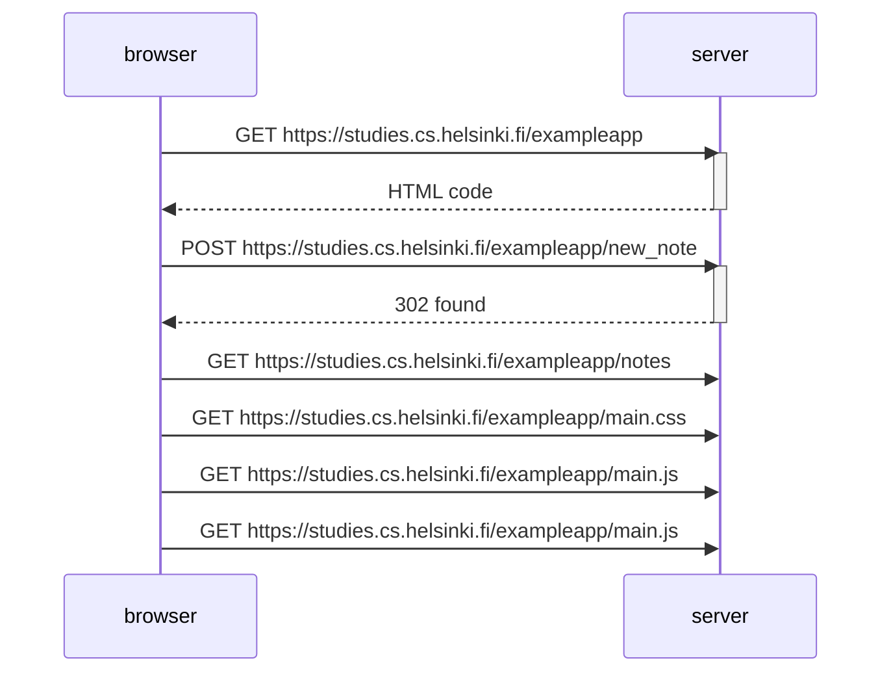

```mermaid
sequenceDiagram
participant browser
participant server

    browser->>server: GET https://studies.cs.helsinki.fi/exampleapp
    activate server
    server-->>browser: HTML code
    deactivate server


    browser->>server: POST https://studies.cs.helsinki.fi/exampleapp/new_note
    activate server
    server-->>browser: 302 found
    deactivate server

    browser->>server: GET https://studies.cs.helsinki.fi/exampleapp/notes

    browser->>server: GET https://studies.cs.helsinki.fi/exampleapp/main.css

    browser->>server: GET https://studies.cs.helsinki.fi/exampleapp/main.js

    browser->>server: GET https://studies.cs.helsinki.fi/exampleapp/main.js

```
